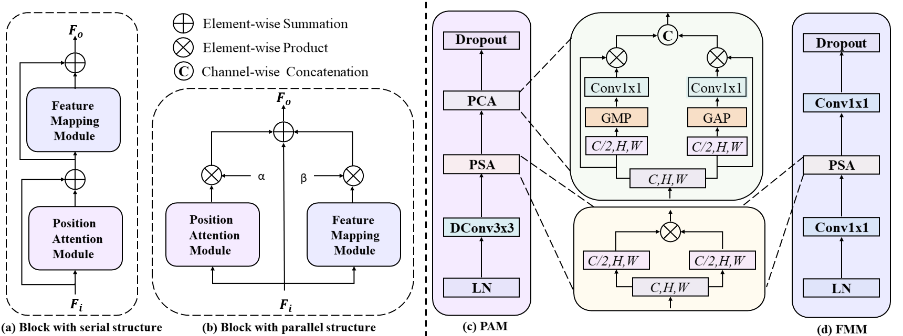
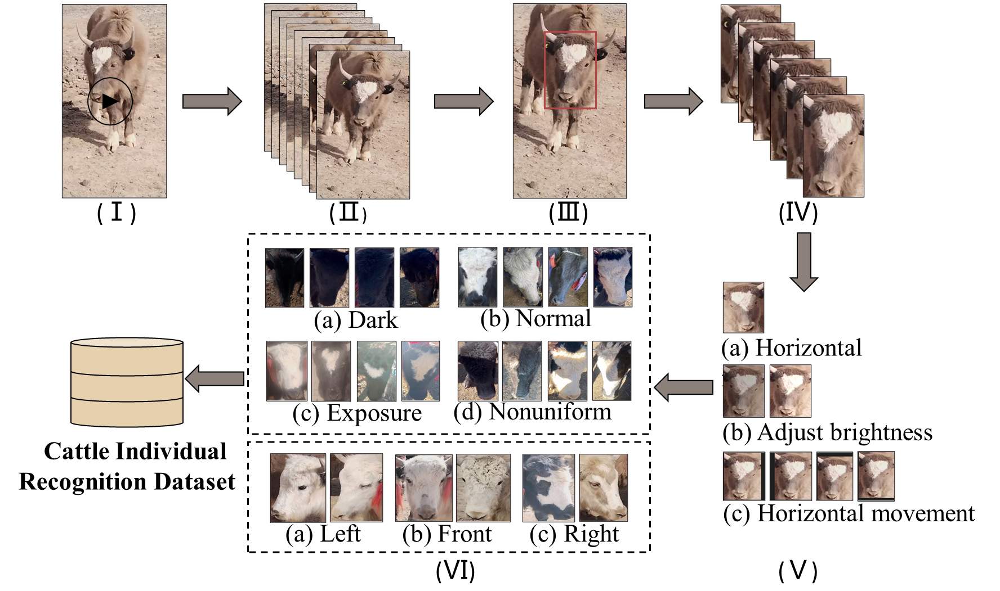

# A Parallel Attention Network for Cattle Face Recognition

This repository is the official PyTorch implementation of the paper *PANet* accepted by ICME 2024.



## Requirements

To install dependencies:

```bash
pip install -r requirements.txt
```

## Dataset


The data creation process involves: 
1. capturing videos of cattle; 
2. extracting video frames; 
3. annotating the face regions of the cattle; 
4. cropping out the face portions of the cattle; 
5. augmenting the data; 
6. annotating the lighting conditions and orientation of the cattle's faces.

In this paper, we divided the dataset into training and testing sets in an 8:2 ratio. Each set contains several subfolders, where each subfolder represents an individual cattle. The images within each subfolder represent all the samples for that particular cattle.

The feature library consists of a single registration image for each cattle in the testing set. The structure and naming conventions of the feature library mirror those of the testing set, but each cow in the feature library has only one registration image.

The folders for the training set, testing set, and feature library are organized within the `data` directory, structured as follows:

```
- data
  - train
    - 0
      - image1
      - image2
      - ...
    - 1
      - image1
      - image2
      - ...
    - ...
  - test
    - 385
      - image1
      - image2
      - ...
    - 386
      - image1
      - image2
      - ...
    - 387
      - image1
      - image2
      - ...
  - library
    -385
      - image
    -387
      - image
    -388
      - image
    - ...
```

## Training

To train the models in the paper, run these commands:

```bash
python train.py
```

## Evaluation

To eval the pre-trained models on the dataset, run:

```bash
python eval.py
````
